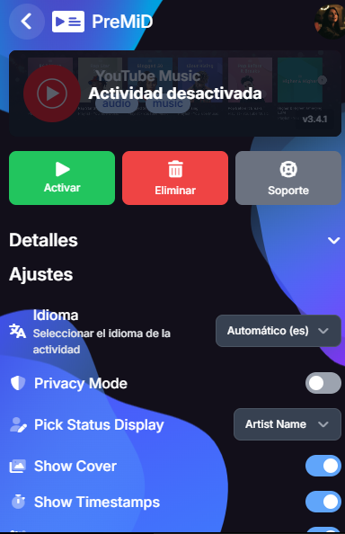
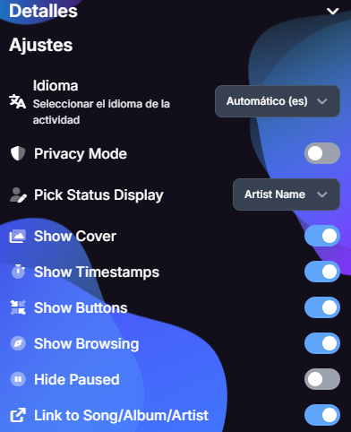

# YouTube Music Sync para PreMiD

Actividad comunitaria para mostrar en Discord la canción que estás escuchando en [YouTube Music](https://music.youtube.com/) mediante [PreMiD](https://premid.app/). Este repositorio adapta la actividad oficial **YouTube Music** de PreMiD para corregir problemas de sincronización observados en la versión 3.4.1.

> Proyecto independiente. No es una publicación oficial de PreMiD, YouTube, Google ni Discord.

## Vista de la actividad

Las siguientes capturas muestran la interfaz de configuración de PreMiD usada como referencia. Fueron tomadas antes de cargar esta versión; el resultado en Discord depende de tu sesión y de tus ajustes.

| Actividad | Ajustes |
| --- | --- |
|  |  |

## Qué corrige

- Lee el título, artista y enlace del tema actual en cada actualización del reproductor.
- Recalcula los tiempos en cada actualización, incluso cuando una playlist pasa sola a la siguiente canción.
- Actualiza la actividad al cargar o empezar el siguiente video, sin esperar al próximo ciclo de PreMiD.
- Detecta los cambios de título y portada al seleccionar **Play** en la playlist o al avanzar automáticamente.
- Usa el tiempo visible si el video todavía conserva datos del tema anterior durante la transición.
- Reconoce la pausa a partir del reproductor y obtiene el video actual en cada actualización aunque YouTube Music lo reemplace.
- Ignora las imágenes transparentes del reproductor y usa la miniatura real del video.
- Lee título, artista y carátula de la interfaz actual de YouTube Music, con compatibilidad con selectores anteriores.
- Limpia la actividad cuando no hay reproducción y el ajuste **Show Browsing** está desactivado.

Se conservan los ajustes de PreMiD para privacidad, carátula, botones, navegación, pausa y enlaces.

## Cambios rápidos y Discord

[Discord documenta un máximo de 5 actualizaciones de actividad en 20 segundos para `UpdateActivity` del Game SDK](https://github.com/discord/discord-api-docs/blob/main/developers/developer-tools/game-sdk.mdx); también indica [5 cambios de estado de juego cada 20 segundos](https://github.com/discord/discord-api-docs/blob/main/developers/events/gateway-events.mdx). La [documentación de `SET_ACTIVITY`](https://github.com/discord/discord-api-docs/blob/main/developers/topics/rpc.mdx) no publica un cupo específico para el recorrido de PreMiD. Por eso, **5 cada 20 segundos es una referencia de Discord, no una medición confirmada del límite exacto de PreMiD**.

La versión **v0.0.2** separa los envíos de `setActivity` al menos **4,1 segundos** y evita reenviar el mismo estado. Si cambiás varias canciones en ese intervalo, conserva la más reciente para el próximo envío: algunas canciones intermedias pueden no aparecer en Discord. YouTube Music puede cambiar de pista inmediatamente mientras el estado tarda unos segundos en reflejarlo.

## Descarga e instalación

Descargá el ZIP **`YouTube-Music-PreMiD-sincronizacion-v0.0.2.zip`** desde el [release v0.0.2](https://github.com/GermanBartoli/premid-youtube-music-sync/releases/tag/v0.0.2). El ZIP contiene la actividad **compilada**; no hay que descomprimirlo.

1. Abrí la extensión de PreMiD y activá **Activity Developer Mode** en **Settings → Developer**.
2. En **Developer**, elegí **Load Compiled Activity** y seleccioná el ZIP.
3. Desactivá la actividad oficial de YouTube Music si ambas aparecen activas para el mismo sitio.
4. Abrí o recargá [music.youtube.com](https://music.youtube.com/), reproducí una canción y comprobá el estado en Discord.

La [guía de carga de PreMiD](https://docs.premid.app/v1/guide/loading-activities.html) explica este flujo. Necesitás la extensión de PreMiD y Discord de escritorio. **v0.0.2** es la versión publicada aquí y contiene la actividad **3.4.6**.

## Estructura

```text
activity/          Código TypeScript, metadatos y traducciones de la actividad
dist/              Archivos compilados que usa PreMiD
docs/media/        Capturas de la interfaz de referencia
docs/              Arquitectura y verificaciones
tests/             Pruebas del cambio automático de canción
.github/workflows/ Validación con la herramienta oficial de PreMiD
LICENSE            Mozilla Public License 2.0
```

## Desarrollo

El código se compila con la [CLI oficial de PreMiD](https://docs.premid.app/v1/guide/installation.html) dentro del repositorio [PreMiD/Activities](https://github.com/PreMiD/Activities):

1. Copiá el contenido de `activity/` a `websites/Y/YouTube Music/` de una copia de `PreMiD/Activities`.
2. Instalá las dependencias de desarrollo siguiendo las instrucciones del proyecto oficial.
3. Ejecutá `node cli/dist/index.js build "YouTube Music" --zip` desde la raíz de esa copia.
4. El resultado aparece en `websites/Y/YouTube Music/dist/`.

El flujo automatizado en [`.github/workflows/validar.yml`](.github/workflows/validar.yml) ejecuta las pruebas, repite la compilación y comprueba que el ZIP contenga los tres archivos requeridos. Ver [arquitectura](docs/arquitectura.md) y [verificaciones](docs/verificacion.md).

## Límites y privacidad

La actividad depende del DOM y del reproductor de YouTube Music; un cambio de su interfaz puede requerir otra actualización. La v0.0.2 se compiló y se probaron cinco pistas seguidas en el navegador. **Todavía no se verificó el estado final en Discord con el ZIP v0.0.2 cargado en PreMiD.**

El código de la actividad lee información de la pestaña de YouTube Music para que PreMiD muestre el estado en Discord. No incluye servidor propio, telemetría ni credenciales. Los botones y enlaces llevan a YouTube Music cuando están habilitados.

## Licencia y créditos

Basado en la [actividad YouTube Music de PreMiD](https://github.com/PreMiD/Activities/tree/main/websites/Y/YouTube%20Music), cuyo autor original figura en `activity/metadata.json`. Se conserva la licencia [Mozilla Public License 2.0](LICENSE) y se detallan los cambios y créditos en [THIRD_PARTY_NOTICES.md](THIRD_PARTY_NOTICES.md).
