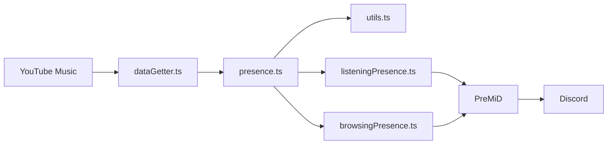

# Arquitectura

La extensión de PreMiD inyecta `presence.js` en `music.youtube.com` y solicita actualizaciones mediante el evento `UpdateData`. La actividad lee los datos visibles del reproductor y forma un `PresenceData` para Discord.

## Datos y estado

`dataGetter.ts` lee el elemento `video.video-stream` y la información de la canción. Prioriza los selectores actuales `ytmusicTrackInfo*` y conserva los selectores anteriores como respaldo. El estado de reproducción y pausa se obtiene del video cuando su duración es válida.

`presence.ts` conserva el identificador de canción y los tiempos. Se vuelve a calcular el intervalo al cambiar de canción, reproducir o buscar otra posición. Si YouTube Music reemplaza el elemento de video, se retiran los listeners anteriores y se asocian al nuevo elemento.

`utils.ts` usa `getTimestamps` de PreMiD para convertir posición y duración a tiempos Unix. El contador que avanza no forma parte del identificador de canción. Si el video aún no tiene tiempos válidos, se intenta leer el texto del reproductor.

`listeningPresence.ts` aplica las preferencias de PreMiD al estado musical. `browsingPresence.ts` muestra navegación cuando está habilitada y no hay reproducción.

## Dependencias

La actividad compilada incluye las funciones de `premid` mediante el empaquetador oficial. El ZIP no requiere que el usuario instale Node.js. Node.js y las dependencias de desarrollo de `PreMiD/Activities` solo son necesarios para compilar desde el código fuente.
