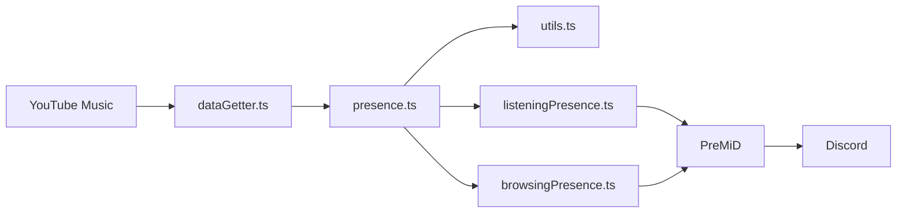

# Arquitectura

La extensión de PreMiD inyecta `presence.js` en `music.youtube.com` y solicita actualizaciones mediante el evento `UpdateData`. La actividad lee los datos visibles del reproductor y forma un `PresenceData` para Discord.

## Datos y estado

`dataGetter.ts` lee el elemento `video.video-stream` y la información de la canción. Prioriza los selectores actuales `ytmusicTrackInfo*` y conserva los selectores anteriores como respaldo. El estado de reproducción y pausa se obtiene del video cuando su duración es válida.

`presence.ts` consulta la posición y duración en cada evento `UpdateData`. También observa la información visible de la pista y actualiza al cambiar título o portada, cargar o empezar un video. Tras un cambio de pista vuelve a consultar el reproductor para cubrir el reemplazo tardío del video; retira los eventos anteriores y escucha el nuevo.

Antes de llamar a `setActivity`, `presence.ts` descarta estados repetidos y separa los envíos al menos 4,1 segundos. Cuando hay varios cambios rápidos, reemplaza el envío pendiente por la pista más reciente. Esto limita los envíos sin ralentizar el reproductor de YouTube Music. La cifra toma como referencia [los 5 cambios cada 20 segundos que Discord documenta para `UpdateActivity` del Game SDK](https://github.com/discord/discord-api-docs/blob/main/developers/developer-tools/game-sdk.mdx); [Discord no publica un cupo equivalente para `SET_ACTIVITY` de PreMiD](https://github.com/discord/discord-api-docs/blob/main/developers/topics/rpc.mdx).

`utils.ts` usa `getTimestamps` de PreMiD para convertir posición y duración a tiempos Unix. Si la duración visible y la del video difieren durante un cambio de canción, prioriza la visible. También usa el contador visible cuando el video muestra una posición incoherente; si ambos datos son inválidos, omite el intervalo.

`listeningPresence.ts` aplica las preferencias de PreMiD al estado musical. `browsingPresence.ts` muestra navegación cuando está habilitada y no hay reproducción.

`dataGetter.ts` descarta las imágenes transparentes del reproductor y elige la miniatura real del tema o video.

## Dependencias

La actividad compilada incluye las funciones de `premid` mediante el empaquetador oficial. El ZIP no requiere que el usuario instale Node.js. Node.js y las dependencias de desarrollo de `PreMiD/Activities` solo son necesarios para compilar desde el código fuente.
